> **English** | [中文](README_cn.md)

# Agentic Marketing Content Generation

A multi-agent automated marketing content generation system built on [Microsoft Agent Framework](https://github.com/microsoft/agent-framework) and [Microsoft Foundry](https://ai.azure.com).

> **From idea to campaign in minutes**: Enter a product/topic, get publish-ready marketing materials automatically.

```
📝 Input: "AI Fitness Coach"
     ↓
🤖 4 Specialized Agents + Real-time Web Research
     ↓
📦 Output: Strategy + Blog + LinkedIn/Instagram/Rednote Posts + Images + TikTok Short Video
```

**Who is this for?**
- Founders & PMs who need marketing content fast
- Content operators managing multi-platform publishing
- Developers exploring AI Agent workflows 

### Generated Content List

| Category | Content | Description |
|----------|---------|-------------|
| **📊 Strategy** | Marketing Strategy | Target audience, pain points, selling points, content framework, tone of voice, brand pillars, keywords |
| **✍️ Copywriting** | Hero Message | One-sentence elevator pitch for the campaign |
| | Blog Article | Full long-form article in Markdown format with intro, body, and CTA |
| | Blog Outline | Structured outline for the blog content |
| | Social Posts (LinkedIn) | Professional tone post with hook, body, and CTA |
| | Social Posts (Instagram) | Visual-focused post with hashtags |
| | Social Posts (Rednote) | Authentic recommendation-style post |
| | Email Campaign | A/B testable subject lines, HTML/plain text body, CTA button, P.S. line |
| | Pain Point Analysis | Problem → Solution format analysis |
| | CTA Variations | Multiple call-to-action options (direct, curiosity, interactive) |
| **🖼️ Images** | Image Prompts | Detailed prompts for AI image generation (English) |
| | Scene Descriptions | Human-readable scene descriptions |
| | Generated Images | AI-generated marketing images (PNG files) |
| **🎬 Video** | Video Script | Three-act structure (Problem → Solution → Transformation) |
| | Scene Breakdown | Per-scene visuals, voiceover, screen text, duration |
| | SRT Captions | Subtitle file in SRT format |
| | Structure Notes | High-level video structure summary |
| | Tiktok Short Videos | AI-generated video clips (MP4 files) |

## Architecture Overview

```mermaid
%%{init: {'theme': 'dark', 'themeVariables': { 'fontSize': '16px', 'fontFamily': 'Inter, system-ui, sans-serif', 'primaryColor': '#0ea5e9', 'primaryTextColor': '#f8fafc', 'primaryBorderColor': '#0284c7', 'lineColor': '#38bdf8', 'secondaryColor': '#8b5cf6', 'tertiaryColor': '#06b6d4', 'background': '#0f172a', 'mainBkg': '#1e293b', 'nodeBorder': '#334155', 'clusterBkg': '#1e293b', 'clusterBorder': '#475569', 'titleColor': '#f1f5f9'}}}%%
flowchart TB
    subgraph Workflow[" 🚀 Marketing Workflow "]
        direction TB
        Input(["📝 Topic Input"]):::input --> StrategyPhase
        
        subgraph StrategyPhase[" 🎯 Strategy Phase "]
            SA["Strategy Agent<br/>Single Generation"]:::agent
            
            subgraph DR[" 🔬 DeepResearch Executor "]
                direction LR
                Planner["📋 Planner"]:::research
                Researcher["🔍 Researcher"]:::research
                Analyst["📊 Analyst"]:::research
                Planner --> Researcher --> Analyst
            end
            
            SA -.->|OR| DR
        end
        
        StrategyPhase -->|MarketingStrategy| ContentPhase
        
        subgraph ContentPhase[" ✨ Content Generation "]
            direction TB
            Copy["✍️ Copywriting Agent<br/>Knowledge-based Expert"]:::agent
            Image["🖼️ Image Agent<br/>+ FLUX"]:::agent
            Video["🎬 Video Agent<br/>+ Sora-2"]:::agent
            Copy --> Image --> Video
        end
        
        ContentPhase --> Pack["📦 Packaging Executor"]:::executor
        Pack --> Output(["🎁 CampaignPackage"]):::output
    end
    
    subgraph External[" 🔌 External Function Tools "]
        direction LR
        Tavily[("🔍 Tavily")]:::service
        FLUX[("🎨 FLUX")]:::service
        Sora[("🎥 Sora-2")]:::service
    end
    
    Tavily -.->|web_search| SA
    Tavily -.->|web_search| Researcher
    Tavily -.->|web_search| Copy
    FLUX -.->|generate_image| Image
    Sora -.->|generate_video| Video
    
    classDef agent fill:#0ea5e9,stroke:#0284c7,stroke-width:2px,color:#f8fafc,font-weight:bold
    classDef executor fill:#f97316,stroke:#ea580c,stroke-width:2px,color:#f8fafc,font-weight:bold
    classDef research fill:#06b6d4,stroke:#0891b2,stroke-width:2px,color:#f8fafc,font-weight:bold
    classDef service fill:#8b5cf6,stroke:#7c3aed,stroke-width:2px,color:#f8fafc,font-weight:bold
    classDef input fill:#22c55e,stroke:#16a34a,stroke-width:2px,color:#f8fafc,font-weight:bold
    classDef output fill:#ec4899,stroke:#db2777,stroke-width:2px,color:#f8fafc,font-weight:bold
```



## Features

- **Modular Agent Design**: Four specialized Agents - Strategy, Copywriting, Image, and Video
- **Deep Research Mode**: Optional DeepResearchExecutor that performs multi-round web searches for market research
- **AI Content Generation**: Integrated FLUX image generation and Sora-2 video generation
- **Knowledge-based Copywriting Style**: Copywriting Agent uses an authentic, experience-based writing style
- **Structured Output**: All content packaged as `CampaignPackage` Pydantic model
- **File Persistence**: Automatically saved to `artifacts/campaigns/<timestamp>/`

## Quick Start

### 1. Install Dependencies

```bash
pip install -r requirements.txt
pip install agent-framework --pre # or install from source
```

### 2. Configure Environment Variables

```bash
cp .env.example .env
```

Required configuration:
```env
# Azure OpenAI (Main Model)
AZURE_OPENAI_ENDPOINT=https://<your-resource>.openai.azure.com/
AZURE_OPENAI_API_KEY=<your-api-key>
AZURE_OPENAI_CHAT_DEPLOYMENT_NAME=gpt-5-mini
AZURE_OPENAI_API_VERSION=2025-04-01-preview

# Tavily Search (Market Research)
Tvly_API_KEY=<your-tavily-key>
```

Optional configuration (enable AI generation):
```env
# FLUX Image Generation
AZURE_IMAGE_ENDPOINT=https://<your-resource>.openai.azure.com/openai/v1/
AZURE_IMAGE_API_KEY=<your-api-key>
AZURE_IMAGE_DEPLOYMENT_NAME=FLUX.1-Kontext-pro

# Sora-2 Video Generation
AZURE_VIDEO_ENDPOINT=https://<your-resource>.openai.azure.com/openai/v1/videos
AZURE_VIDEO_API_KEY=<your-api-key>
AZURE_VIDEO_DEPLOYMENT_NAME=sora-2
```

### 3. Run

```bash
# Basic mode
python -m marketing_workflow.cli "AI Fitness Coach"

# Deep research mode: multi-round web search + data-driven strategy
python -m marketing_workflow.cli "AI Fitness Coach" --deep-research

# Full generation: including AI images and videos
python -m marketing_workflow.cli "AI Fitness Coach" --enable-image-gen --enable-video-gen

# Debug mode
python -m marketing_workflow.cli "AI Fitness Coach" --debug
```

## CLI Options

| Option | Description |
|--------|-------------|
| `--deep-research` | Enable deep research mode (Planner → Researcher → Analyst) |
| `--enable-image-gen` | Enable FLUX AI image generation |
| `--enable-video-gen` | Enable Sora-2 AI video generation |
| `--debug` | Show Agent execution process |
| `--no-persist` | Don't save files to disk |

## Output Structure

```
artifacts/campaigns/20251201_160510_campaign/
├── manifest.json           # Complete CampaignPackage
├── strategy/
│   ├── strategy.json
│   └── strategy.md
├── copywriting/
│   ├── hero_message.md
│   ├── blog.md
│   └── social_posts.json
├── images/
│   ├── prompts.json
│   └── *.png
└── video/
    ├── video_script.json
    └── *.mp4
```

## Code Usage

```python
from agent_framework.azure import AzureOpenAIChatClient
from marketing_workflow import AgenticMarketingWorkflow, MarketingWorkflowConfig

client = AzureOpenAIChatClient(
    endpoint="https://<resource>.openai.azure.com/",
    deployment_name="gpt-5",
    api_key="<your-key>",
)

workflow = AgenticMarketingWorkflow(
    client,
    config=MarketingWorkflowConfig(
        enable_deep_research=True,
        enable_image_generation=True,
    ),
)

package = await workflow.run("AI Fitness Coach")
print(package.copywriting.hero_message)
```

## Project Structure

```
marketing_workflow/
├── workflow.py     # Main workflow orchestration
├── agents.py       # Agent definitions and instructions
├── research.py     # Deep research executor
├── schemas.py      # Pydantic data models
├── tools.py        # Tool implementations (Tavily, FLUX, Sora-2)
└── cli.py          # Command line entry point
```
