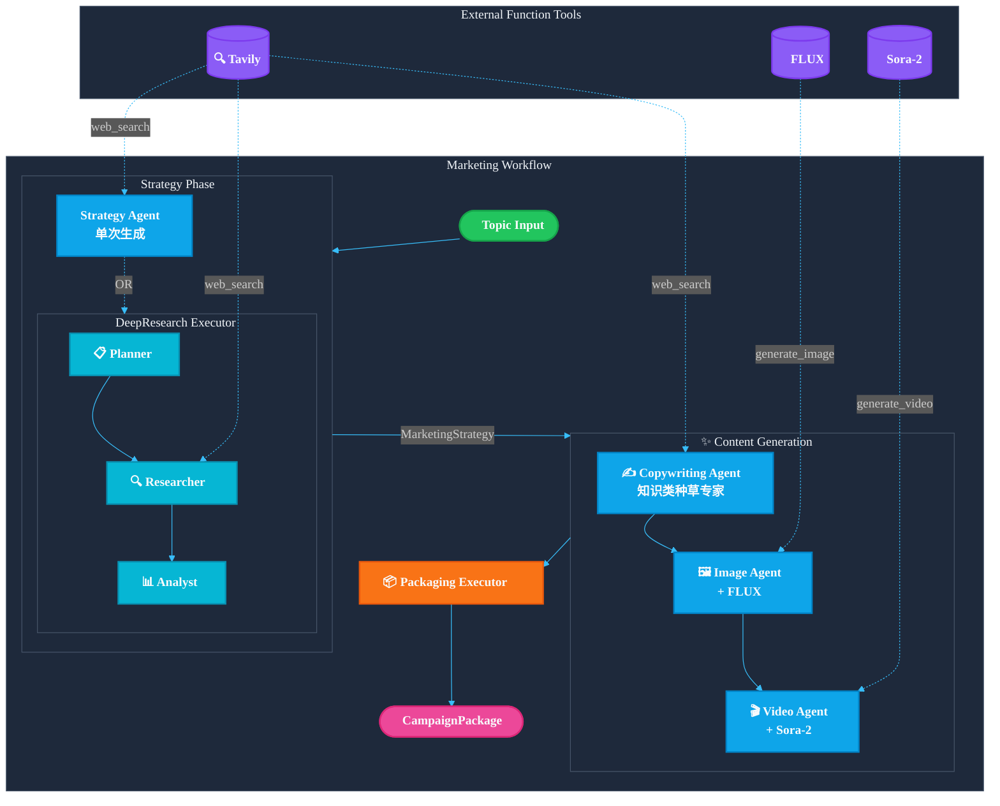

> [English](README.md) | **中文**

# Agentic Marketing Content Generation

基于 [Microsoft Agent Framework](https://github.com/microsoft/agent-framework) 和 [Microsoft Foundry](https://ai.azure.com) 的多智能体自动化营销内容生成系统。

> **从想法到全套内容**：输入一个产品/话题，自动生成可直接发布的全套营销物料。

```
📝 输入: "ESP32 AI 具身智能教育产品"
     ↓
🤖 4个专业 Agent 协作 + 实时网络调研
     ↓
📦 输出: 营销策略 + 博客 + 小红书/LinkedIn/Instagram 文案 + 配图 + 短视频
```

**适合谁用？**

- 需要快速产出营销内容的创业者、产品经理
- 想要批量生成多平台内容的内容运营
- 探索 AI Agent 工作流的开发者

### 生成内容清单

| 类别                | 内容                    | 说明                                                               |
| ------------------- | ----------------------- | ------------------------------------------------------------------ |
| **📊 策略**   | 营销策略                | 目标受众、痛点分析、卖点提炼、内容框架、语调风格、品牌支柱、关键词 |
| **✍️ 文案** | 核心信息 (Hero Message) | 一句话电梯演讲，传达核心价值                                       |
|                     | 博客文章                | Markdown 格式长文，包含引言、正文、CTA                             |
|                     | 博客大纲                | 结构化的博客内容大纲                                               |
|                     | 社交帖子 (LinkedIn)     | 专业风格帖子，正文、CTA                                            |
|                     | 社交帖子 (Instagram)    | 视觉导向帖子                                                       |
|                     | 社交帖子 (小红书)       | 种草文风格，第一人称真实体验感                                     |
|                     | 痛点分析                | 「痛点 → 解决方案」格式                                           |
|                     | CTA 变体                | 多种行动号召风格（直接型、好奇型、互动型）                         |
| **🖼️ 图像** | 图像提示词              | AI 图像生成的详细 prompt（英文）                                   |
|                     | 场景描述                | 人类可读的场景描述                                                 |
|                     | 生成图像                | AI 生成的营销配图（PNG 文件）                                      |
| **🎬 视频**   | 视频脚本                | 三幕式结构（问题 → 解决方案 → 转变）                             |
|                     | 场景分解                | 每场景的画面、旁白、屏幕文字、时长                                 |
|                     | SRT 字幕                | SRT 格式的字幕文件                                                 |
|                     | 结构说明                | 视频高层结构摘要                                                   |
|                     | 手机短视频              | AI 生成的竖屏视频片段（MP4 文件）                                  |

## 架构概览



## 特性

- **模块化 Agent 设计**：Strategy、Copywriting、Image、Video 四个专业 Agent
- **深度研究模式**：可选的 DeepResearchExecutor，执行多轮 web 搜索进行市场调研
- **AI 内容生成**：集成 FLUX 图像生成和 Sora-2 视频生成
- **种草文案风格**：Copywriting Agent 采用「知识类种草文案专家」写作风格
- **结构化输出**：所有内容打包为 `CampaignPackage` Pydantic 模型
- **文件持久化**：自动保存到 `artifacts/campaigns/<timestamp>/`

## 快速开始

### 1. 安装依赖

```bash
pip install -r requirements.txt
pip install agent-framework --pre  # 或从源码安装
```

### 2. 配置环境变量

```bash
cp .env.example .env
```

必需配置：

```env
# Azure OpenAI (主模型)
AZURE_OPENAI_ENDPOINT=https://<your-resource>.openai.azure.com/
AZURE_OPENAI_API_KEY=<your-api-key>
AZURE_OPENAI_CHAT_DEPLOYMENT_NAME=gpt-5-mini
AZURE_OPENAI_API_VERSION=2025-04-01-preview

# Tavily Search (市场调研)
Tvly_API_KEY=<your-tavily-key>
```

可选配置（启用 AI 生成）：

```env
# FLUX 图像生成
AZURE_IMAGE_ENDPOINT=https://<your-resource>.openai.azure.com/openai/v1/
AZURE_IMAGE_API_KEY=<your-api-key>
AZURE_IMAGE_DEPLOYMENT_NAME=FLUX.1-Kontext-pro

# Sora-2 视频生成
AZURE_VIDEO_ENDPOINT=https://<your-resource>.openai.azure.com/openai/v1/videos
AZURE_VIDEO_API_KEY=<your-api-key>
AZURE_VIDEO_DEPLOYMENT_NAME=sora-2
```

### 3. 运行

```bash
# 基础模式
python -m marketing_workflow.cli "ESP32 AI 具身智能教育产品"

# 深度研究模式：多轮 web 搜索 + 数据驱动策略
python -m marketing_workflow.cli "ESP32 AI 具身智能教育产品" --deep-research

# 完整生成：包含 AI 图像和视频
python -m marketing_workflow.cli "ESP32 AI 具身智能教育产品" --enable-image-gen --enable-video-gen

# 调试模式
python -m marketing_workflow.cli "ESP32 AI 具身智能教育产品" --debug
```

## CLI 选项

| 选项                   | 说明                                                 |
| ---------------------- | ---------------------------------------------------- |
| `--deep-research`    | 启用深度研究模式（Planner → Researcher → Analyst） |
| `--enable-image-gen` | 启用 FLUX AI 图像生成                                |
| `--enable-video-gen` | 启用 Sora-2 AI 视频生成                              |
| `--debug`            | 显示 Agent 执行过程                                  |
| `--no-persist`       | 不保存文件到磁盘                                     |

## 输出结构

```
artifacts/campaigns/20251201_160510_campaign/
├── manifest.json           # 完整 CampaignPackage
├── strategy/
│   ├── strategy.json
│   └── strategy.md
├── copywriting/
│   ├── hero_message.md
│   ├── blog.md
│   └── social_posts.json
├── images/
│   ├── prompts.json
│   └── *.png
└── video/
    ├── video_script.json
    └── *.mp4
```

## 代码使用

```python
from agent_framework.azure import AzureOpenAIChatClient
from marketing_workflow import AgenticMarketingWorkflow, MarketingWorkflowConfig

client = AzureOpenAIChatClient(
    endpoint="https://<resource>.openai.azure.com/",
    deployment_name="gpt-5",
    api_key="<your-key>",
)

workflow = AgenticMarketingWorkflow(
    client,
    config=MarketingWorkflowConfig(
        enable_deep_research=True,
        enable_image_generation=True,
    ),
)

package = await workflow.run("ESP32 AI 具身智能教育产品")
print(package.copywriting.hero_message)
```

## 项目结构

```
marketing_workflow/
├── workflow.py     # 主工作流编排
├── agents.py       # Agent 定义和指令
├── research.py     # 深度研究执行器
├── schemas.py      # Pydantic 数据模型
├── tools.py        # 工具实现 (Tavily, FLUX, Sora-2)
└── cli.py          # 命令行入口
```
