> **English** | [中文](design_cn.md)

# Agentic Marketing Content Workflow - Architecture Design

**Goal**: Input a topic → Automatically generate a complete marketing asset package

## System Architecture

```mermaid
%%{init: {'theme': 'dark', 'themeVariables': { 'fontSize': '16px', 'fontFamily': 'Inter, system-ui, sans-serif', 'primaryColor': '#0ea5e9', 'primaryTextColor': '#f8fafc', 'primaryBorderColor': '#0284c7', 'lineColor': '#38bdf8', 'background': '#0f172a', 'mainBkg': '#1e293b', 'clusterBkg': '#1e293b', 'clusterBorder': '#475569'}}}%%
flowchart TB
    Input(["📝 Topic"]):::input --> StrategyPhase
    
    subgraph StrategyPhase[" 🎯 Strategy Phase "]
        direction LR
        SA["Strategy Agent"]:::agent
        DR["DeepResearch Executor"]:::executor
        SA -.->|"OR"| DR
    end
    
    StrategyPhase ==>|"MarketingStrategy"| ContentPhase
    
    subgraph ContentPhase[" ✨ Content Generation Phase "]
        direction TB
        Copy["✍️ Copywriting"]:::agent -->|"CopywritingContent"| Image["🖼️ Image"]:::agent
        Image -->|"ImageContent"| Video["🎬 Video"]:::agent
    end
    
    ContentPhase ==>|"VideoScript"| PackPhase
    
    subgraph PackPhase[" 📦 Packaging Phase "]
        Pack["Packaging Executor"]:::executor --> Output(["🎁 CampaignPackage"]):::output
    end
    
    Tavily[("🔍 Tavily")]:::service -.->|web_search| StrategyPhase & Copy
    FLUX[("🎨 FLUX")]:::service -.->|generate_image| Image
    Sora[("🎥 Sora-2")]:::service -.->|generate_video| Video
    FS[("💾 FileSystem")]:::service -.-> Pack
    
    classDef agent fill:#0ea5e9,stroke:#0284c7,stroke-width:2px,color:#f8fafc,font-weight:bold
    classDef executor fill:#f97316,stroke:#ea580c,stroke-width:2px,color:#f8fafc,font-weight:bold
    classDef service fill:#8b5cf6,stroke:#7c3aed,stroke-width:2px,color:#f8fafc,font-weight:bold
    classDef input fill:#22c55e,stroke:#16a34a,stroke-width:2px,color:#f8fafc,font-weight:bold
    classDef output fill:#ec4899,stroke:#db2777,stroke-width:2px,color:#f8fafc,font-weight:bold
```



## Agent Responsibilities

| Agent | Input | Output | Tools |
|-------|-------|--------|-------|
| **Strategy Agent** | Topic | `MarketingStrategy` | `web_search` |
| **DeepResearch Executor** | Topic | `MarketingStrategy` | `web_search` (multi-round) |
| **Copywriting Agent** | Strategy | `CopywritingContent` | `web_search` |
| **Image Agent** | Strategy + Copy | `ImageContent` | `generate_image` (FLUX) |
| **Video Agent** | Strategy + Copy | `VideoScript` | `generate_video` (Sora-2) |
| **Packaging Executor** | All outputs | `CampaignPackage` | File system |

## Deep Research Mode (DeepResearchExecutor)

When `--deep-research` is enabled, Strategy Agent is replaced by DeepResearchExecutor.

### Architecture Diagram

```mermaid
%%{init: {'theme': 'dark', 'themeVariables': { 'fontSize': '16px', 'fontFamily': 'Inter, system-ui, sans-serif', 'primaryColor': '#06b6d4', 'primaryTextColor': '#f8fafc', 'primaryBorderColor': '#0891b2', 'lineColor': '#22d3ee', 'background': '#0f172a', 'mainBkg': '#1e293b', 'clusterBkg': '#1e293b', 'clusterBorder': '#475569'}}}%%
flowchart TB
    subgraph DRE[" 🔬 DeepResearchExecutor "]
        direction TB
        Topic(["📝 Topic"]):::input --> P1
        
        subgraph P1[" 📋 Phase 1: Planning "]
            Planner["🎯 Research Planner"]:::planner
        end
        
        P1 ==>|"ResearchPlan<br/>(3-5 dimensions)"| P2
        
        subgraph P2[" 🔍 Phase 2: Research "]
            direction TB
            Researcher["🕵️ Researcher Agent"]:::researcher
            Researcher --> WS1["🔎 Market Trends"]:::search & WS2["🔎 User Pain Points"]:::search & WS3["🔎 Competitor Analysis"]:::search
        end
        
        P2 ==>|"ResearchFindings<br/>(insights, data, sources)"| P3
        
        subgraph P3[" 📊 Phase 3: Analysis "]
            Analyst["📈 Research Analyst"]:::analyst
        end
        
        P3 ==> Output(["✅ MarketingStrategy"]):::output
    end
    
    Tavily[("🌐 Tavily API")]:::service -.->|web_search| Researcher
    
    classDef planner fill:#06b6d4,stroke:#0891b2,stroke-width:2px,color:#f8fafc,font-weight:bold
    classDef researcher fill:#0ea5e9,stroke:#0284c7,stroke-width:2px,color:#f8fafc,font-weight:bold
    classDef analyst fill:#ec4899,stroke:#db2777,stroke-width:2px,color:#f8fafc,font-weight:bold
    classDef search fill:#f97316,stroke:#ea580c,stroke-width:2px,color:#f8fafc,font-weight:bold
    classDef service fill:#8b5cf6,stroke:#7c3aed,stroke-width:2px,color:#f8fafc,font-weight:bold
    classDef input fill:#22c55e,stroke:#16a34a,stroke-width:2px,color:#f8fafc,font-weight:bold
    classDef output fill:#10b981,stroke:#059669,stroke-width:2px,color:#f8fafc,font-weight:bold
```



### Three-Phase Detailed Flow

#### Phase 1: Research Planning

**Planner Agent** analyzes the topic and outputs a structured research plan:

```json
{
  "topic_analysis": "Core understanding of the topic and marketing scenarios",
  "research_dimensions": [
    {
      "dimension": "Market Trends",
      "priority": "high",
      "search_queries": ["ESP32 IoT market trends 2024", "ESP32 market growth"],
      "info_needed": ["Market size", "Growth rate", "Application scenarios"]
    },
    {
      "dimension": "Target Users",
      "priority": "high", 
      "search_queries": ["maker workshop pain points", "IoT learning challenges"],
      "info_needed": ["User profiles", "Learning barriers", "Demand pain points"]
    },
    {
      "dimension": "Competitor Analysis",
      "priority": "medium",
      "search_queries": ["Arduino workshop vs ESP32", "IoT workshop comparison"],
      "info_needed": ["Competitors", "Differentiation opportunities"]
    }
  ],
  "target_insights": ["Market opportunities", "User pain points", "Differentiation positioning"]
}
```

#### Phase 2: Research Execution

**Researcher Agent** executes multi-round `web_search` by priority:

1. Iterate through `research_dimensions`, sorted by priority
2. Execute `search_queries` for each dimension
3. Use `search_depth="advanced"` for deep results
4. Extract and structure key information

Output format:
```json
{
  "research_findings": [
    {
      "dimension": "Market Trends",
      "key_insights": ["ESP32 is growing rapidly in edge AI", "TinyML is a hot trend"],
      "data_points": ["Global IoT market expected to reach $1.1 trillion by 2025"],
      "trends": ["Edge computing", "Low-power AI"],
      "sources": ["https://..."]
    }
  ],
  "market_overview": "Overall market overview...",
  "competitive_landscape": "Competitive landscape description...",
  "opportunity_areas": ["Education market", "Corporate training"]
}
```

#### Phase 3: Strategy Synthesis

**Analyst Agent** synthesizes research data to generate final `MarketingStrategy`:

- Define target audience based on real data
- Extract user pain points from research findings
- Design differentiated selling points based on market opportunities
- Output JSON conforming to schema

## Data Models

```python
MarketingStrategy:
  topic, target_audience, tone_of_voice
  pain_points[], selling_points[], content_framework[]
  brand_pillars[], keywords[]

CopywritingContent:
  hero_message
  social_posts[] (LinkedIn, Instagram, Xiaohongshu, Twitter)
  blog_article, blog_outline[]
  pain_point_analysis[], cta_variations[]

ImageContent:
  prompts[] (prompt_id, prompt, scene_description)
  assets[] (prompt_id, url, local_path)

VideoScript:
  scenes[] (scene_number, act, voiceover, screen_text, duration_seconds)
  total_duration_seconds, cta, srt_caption

CampaignPackage:
  campaign_id, topic, created_at
  strategy, copywriting, images, video
  package_path
```

## Output Directory

```
artifacts/campaigns/20251201_campaign/
├── manifest.json
├── strategy/
│   ├── strategy.json
│   └── strategy.md
├── copywriting/
│   ├── hero_message.md
│   ├── blog.md
│   └── social_posts.json
├── images/
│   ├── prompts.json
│   └── *.png
└── video/
    ├── video_script.json
    └── *.mp4
```

## Run Modes

| Mode | Command | Features |
|------|---------|----------|
| Basic | `cli "topic"` | Single LLM call to generate strategy |
| Deep Research | `--deep-research` | Multi-round web search + data-driven |
| Image Generation | `--enable-image-gen` | FLUX model generates images |
| Video Generation | `--enable-video-gen` | Sora-2 model generates videos |
