> **English** | [中文](spec_cn.md)

# Technical Specification

Automated marketing content generation system based on Microsoft Agent Framework.

## Tech Stack

```mermaid
%%{init: {'theme': 'dark', 'themeVariables': { 'fontSize': '16px', 'fontFamily': 'Inter, system-ui, sans-serif', 'primaryColor': '#6366f1', 'primaryTextColor': '#f8fafc', 'primaryBorderColor': '#4f46e5', 'lineColor': '#818cf8', 'background': '#0f172a', 'mainBkg': '#1e293b', 'clusterBkg': '#1e293b', 'clusterBorder': '#475569'}}}%%
flowchart LR
    subgraph Framework[" ⚙️ Microsoft Agent Framework "]
        direction TB
        SB["SequentialBuilder"]:::core
        CA["ChatAgent"]:::core
        EX["Executor"]:::core
        SB --- CA --- EX
    end
    
    subgraph LLM[" 🧠 LLM Providers "]
        AO["Azure OpenAI<br/>GPT-5"]:::llm
    end
    
    subgraph Tools[" 🔧 External Tools "]
        direction TB
        TV["🔍 Tavily Search"]:::tool
        FL["🎨 FLUX Image Gen"]:::tool
        SO["🎥 Sora-2 Video Gen"]:::tool
    end
    
    Framework ==> LLM
    Framework ==> Tools
    
    classDef core fill:#6366f1,stroke:#4f46e5,stroke-width:2px,color:#f8fafc,font-weight:bold
    classDef llm fill:#ec4899,stroke:#db2777,stroke-width:2px,color:#f8fafc,font-weight:bold
    classDef tool fill:#06b6d4,stroke:#0891b2,stroke-width:2px,color:#f8fafc,font-weight:bold
```



## Core Components

### 1. AgenticMarketingWorkflow

Main workflow class responsible for:
- Initializing ChatClient and tools
- Creating Agents and Executors
- Orchestrating workflow using SequentialBuilder
- Handling event streams and debug output

```python
class AgenticMarketingWorkflow:
    def __init__(self, chat_client, *, config=None):
        # Initialize tools: TavilySearchTools, FluxImageGenerationTools, SoraVideoGenerationTools
        # Create Agents: create_marketing_agents()
        # Optional: Create DeepResearchExecutor

    async def run(self, topic: str) -> CampaignPackage:
        # Create workflow and execute
        workflow = self._create_workflow(campaign_dir)
        async for event in workflow.run_stream(topic):
            # Handle events...
```

### 2. Agent Definitions (agents.py)

Four specialized ChatAgents:

```python
def create_marketing_agents(chat_client, tool_registry=None) -> MarketingAgents:
    return MarketingAgents(
        strategy=_build_agent("strategy_agent", strategy_instructions),
        copywriting=_build_agent("copywriting_agent", copy_instructions),
        image=_build_agent("image_agent", image_instructions),
        video=_build_agent("video_agent", video_instructions),
    )
```

**Strategy Agent** - Performs multi-round web searches:
- Plans search strategy (market trends, competitors, user pain points)
- Calls `web_search` at least 3 times
- Synthesizes analysis into MarketingStrategy

**Copywriting Agent** - Knowledge-based copywriting expert:
- First-person authentic experience
- Pain point resonance → Discovery → Effect → Call to action
- Outputs multi-platform copy (LinkedIn, Instagram, Xiaohongshu)

**Image Agent** - Image prompt engineer:
- Designs English prompts
- Optionally calls `generate_image` tool

**Video Agent** - Video script expert:
- Three-act structure (Problem/Solution/Transformation)
- Maximum 6 scenes, total duration ≤72 seconds
- Optionally calls `generate_video` tool

### 3. DeepResearchExecutor (research.py)

Optional deep research mode that replaces Strategy Agent.

#### Internal Architecture

```mermaid
%%{init: {'theme': 'dark', 'themeVariables': { 'fontSize': '14px', 'fontFamily': 'Inter, system-ui, sans-serif', 'actorBkg': '#6366f1', 'actorTextColor': '#f8fafc', 'actorBorder': '#4f46e5', 'signalColor': '#e2e8f0', 'signalTextColor': '#f8fafc', 'noteBkgColor': '#334155', 'noteTextColor': '#f8fafc', 'noteBorderColor': '#475569', 'activationBkgColor': '#1e293b', 'activationBorderColor': '#475569', 'sequenceNumberColor': '#f8fafc'}}}%%
sequenceDiagram
    autonumber
    participant W as 🚀 Workflow
    participant DRE as 🔬 DeepResearchExecutor
    participant P as 🎯 Planner
    participant R as 🕵️ Researcher
    participant A as 📊 Analyst
    participant T as 🌐 Tavily

    W->>+DRE: handle(conversation)
    Note over DRE: 📝 Extract topic from conversation
    
    rect rgba(6, 182, 212, 0.2)
        Note over DRE,P: 📋 Phase 1: Research Planning
        DRE->>+P: Create research plan for topic
        P-->>-DRE: ResearchPlan JSON
        Note right of P: 3-5 research dimensions<br/>Search strategy<br/>Priority ranking
    end
    
    rect rgba(14, 165, 233, 0.2)
        Note over DRE,T: 🔍 Phase 2: Research Execution
        DRE->>+R: Execute search queries
        loop Each research dimension (high → low priority)
            R->>+T: web_search(query, depth=advanced)
            T-->>-R: search results
        end
        R-->>-DRE: ResearchFindings JSON
        Note right of R: Market insights<br/>Data points<br/>Information sources
    end
    
    rect rgba(236, 72, 153, 0.2)
        Note over DRE,A: 📈 Phase 3: Strategy Synthesis
        DRE->>+A: Synthesize research data into strategy
        A-->>-DRE: MarketingStrategy JSON
        Note right of A: Target audience<br/>Pain points/Selling points<br/>Content framework
    end
    
    DRE-->>-W: ctx.send_message(strategy)
    Note over W: ✅ Pass to downstream Agents
```



#### Three Internal Agents

| Agent | Responsibility | Input | Output |
|-------|---------------|-------|--------|
| **Planner** | Analyze topic, define research dimensions | topic | ResearchPlan |
| **Researcher** | Execute multi-round web_search | ResearchPlan | ResearchFindings |
| **Analyst** | Synthesize analysis, generate strategy | Plan + Findings | MarketingStrategy |

#### Implementation Code

```python
class DeepResearchExecutor(Executor):
    def __init__(self, chat_client, search_tool, debug=False):
        self._research_agents = create_research_agents(chat_client, search_tool)

    @handler
    async def handle(self, conversation, ctx):
        topic = self._extract_topic(conversation)
        
        # Phase 1: Research Planning
        plan = await self._run_planning(topic)
        # -> {"research_dimensions": [...], "target_insights": [...]}
        
        # Phase 2: Execute Research (multi-round search)
        findings = await self._run_research(topic, plan)
        # -> {"research_findings": [...], "market_overview": "..."}
        
        # Phase 3: Synthesize Strategy
        strategy = await self._run_analysis(topic, plan, findings)
        # -> MarketingStrategy JSON
        
        await ctx.send_message([...conversation, strategy_message])
```

### 4. Tool Implementations (tools.py)

**TavilySearchTools** - Web search:
```python
@ai_function
def web_search(query, search_depth="basic", max_results=5) -> dict
```

**FluxImageGenerationTools** - FLUX image generation:
```python
@ai_function
def generate_image(prompt, prompt_id, size="1024x1024") -> dict
```

**SoraVideoGenerationTools** - Sora-2 video generation:
```python
@ai_function  
def generate_video(prompt, scene_id, seconds=5, size="1280x720") -> dict
```

### 5. PackagingExecutor

Collects all Agent outputs and assembles into CampaignPackage:

```python
class _PackagingExecutor(Executor):
    @handler
    async def handle(self, conversation, ctx):
        package = self._build_package(conversation)
        package = package.with_package_path(
            self._packaging_tools.persist_package(package)
        )
        await ctx.yield_output(package)
```

## Workflow Orchestration


```python
builder = SequentialBuilder().participants([
    strategy_participant,  # Strategy Agent or DeepResearchExecutor
    self._agents.copywriting,
    self._agents.image,
    self._agents.video,
    packaging_executor,
])
workflow = builder.with_checkpointing(checkpoint_storage).build()
```

## Configuration Options

```python
@dataclass
class MarketingWorkflowConfig:
    persist_output: bool = True
    output_dir: str = "artifacts/campaigns"
    enable_image_generation: bool = False
    enable_video_generation: bool = False
    enable_deep_research: bool = False
    debug: bool = False
```

## Environment Variables

```env
# Required
AZURE_OPENAI_ENDPOINT=
AZURE_OPENAI_API_KEY=
AZURE_OPENAI_CHAT_DEPLOYMENT_NAME=
Tvly_API_KEY=

# Optional - Image Generation
AZURE_IMAGE_ENDPOINT=
AZURE_IMAGE_API_KEY=

# Optional - Video Generation
AZURE_VIDEO_ENDPOINT=
AZURE_VIDEO_API_KEY=
```

## Constraints and Limitations

- **Sora-2 Video**: Duration can only be 4/8/12 seconds, API concurrency limit of 2
- **FLUX Images**: Prompts must be in English
- **GPT-5**: Reasoning model, does not support custom temperature
